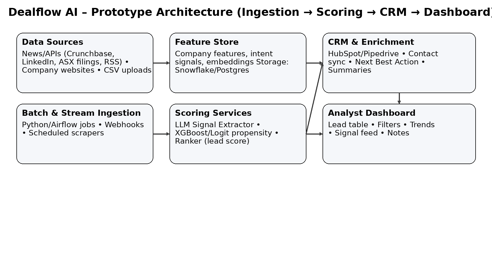
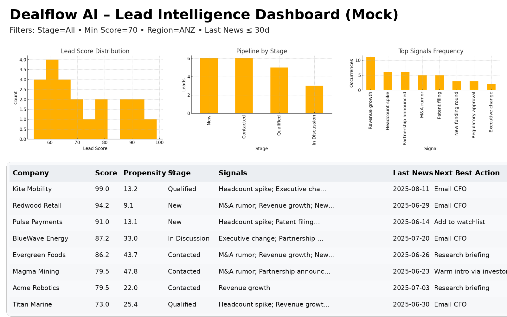

# Dealflow-AI-Prototype-Corporate-Finance-M-A-
Dealflow AI – Prototype (Corporate Finance / M&amp;A)

# Dealflow AI – Prototype (Corporate Finance / M&A)

AI-assisted deal origination to **surface, score, and prioritise** M&A targets or buyers.  
This prototype includes a **Streamlit app**, a **synthetic lead dataset**, and **architecture visuals** for quick stakeholder demonstration.

---

## 🏗 Architecture



**Workflow:**  
1. **Ingestion** – APIs (Crunchbase/LinkedIn/ASX), RSS feeds, CSV drops (Python/Airflow)  
2. **Feature Store** – Company features, embeddings, and intent signals (Snowflake/Postgres)  
3. **Scoring** – LLM-based signal extraction + ML models for propensity & lead score  
4. **CRM Enrichment** – Sync “Next Best Action” and summaries to HubSpot/Pipedrive  
5. **Dashboard** – Filters, pipeline, signal feed, and notes

---

## 📊 Dashboard Mock



---

## 🚀 Quickstart (Local)

```bash
# 1) Clone
git clone https://github.com/<your-username>/dealflow-ai-prototype.git
cd dealflow-ai-prototype

# 2) (optional) Create venv
python -m venv .venv
source .venv/bin/activate        # macOS/Linux
.venv\Scripts\activate           # Windows

# 3) Install
pip install -r requirements.txt

# 4) Run
streamlit run app.py
```

## ☁️ Deploy on Streamlit Cloud
Push this repo to GitHub

Go to streamlit.io → Deploy an app

Select your repo, set:

Main file: app.py

Requirements: requirements.txt

Deploy → share the public URL

## 📁 Project Structure

.
├── app.py
├── data
│   └── sample_leads.csv
├── images
│   ├── dealflow_architecture.png
│   └── mock_dashboard.png
├── .streamlit
│   └── config.toml
├── requirements.txt
├── LICENSE
└── README.md

## 🗺 Roadmap
 Replace CSV with real ingestion (APIs / CSV drops)

 Add LLM signal extraction from news

 Train baseline ML model for propensity & scoring

 CRM push buttons (HubSpot/Pipedrive)

 Airflow jobs for automated refresh

